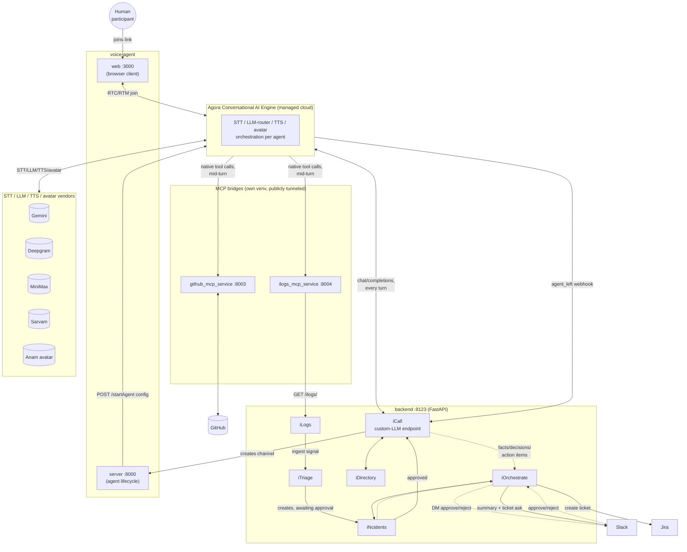
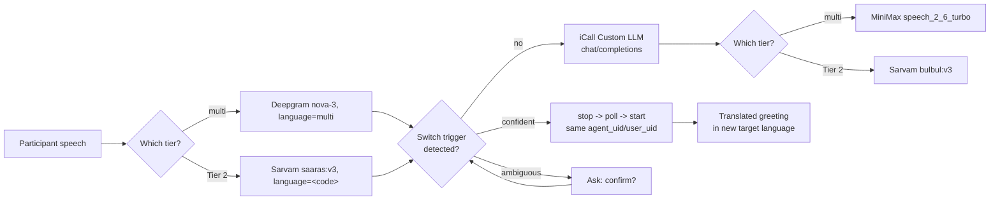

# Watcher

A real-time AI incident commander for the EchoSphere hackathon (team We
thinkED). Joins a live voice incident call, keeps facts separate from
guesses, catches contradictions out loud, assigns and tracks who owns what,
and only takes real actions (a ticket, a Slack post) after a human says yes.

"Watcher" is the agent's name and the user-facing product name; `iThink` is
this repo/backend's original internal codename and still shows up in module
names, package names, and some URLs (`ithink_dev.db`, `ITHINK_BACKEND_BASE_URL`,
etc.) — that's intentional, not a leftover rebrand bug.

This README exists mainly to answer "what does each module actually do" —
the module names (`iLogs`, `iNcidents`, `iTriage`, `iCall`, `iDirectory`,
`iOrchestrate`) don't say that on their own.

## Module map

| Module | Plain-English role | Owns |
|---|---|---|
| `iLogs` | **The ears.** Receives a monitoring/log signal, scores how severe it looks. | Log ingestion, deterministic severity/region/service scoring |
| `iNcidents` | **The incident file + the approval stamp.** Nothing external happens until a human approves here. | Incident lifecycle state machine, the human-approval gate |
| `iTriage` | **The assistant that reads alerts first.** Auto-decides if a log is a real incident and files it for approval — no human has to notice the alert themselves. | Gemini-based triage, automatic incident creation, evidence correlation |
| `iCall` | **The meeting room + the AI notetaker in it.** Creates the voice channel for an approved incident and is the actual brain the voice agent talks to during the call. | Room/channel creation, the custom-LLM endpoint, live structuring (facts/hypotheses/decisions/conflicts/timeline), participant role recognition, two-pass task-ownership assignment, silence/pattern-based spoken nudges, the coordination health score, end-of-call unresolved-risk synthesis, the pre-Jira-ticket content review, the Agora webhook receiver (also the authoritative "call actually ended" signal, independent of the client) |
| `iDirectory` | **The org chart.** Who's on which team, which team owns which service, who's actually available right now. | Teams, employees (with a fixed job-title vocabulary shared with `iCall`'s role classifier), `resolve_approver` / `resolve_responders` |
| `iOrchestrate` | **The messenger.** Turns an incident/call event into a real Slack message or Jira ticket — nothing here happens without a prior human approval upstream, and neither approval gate ever exposes an actionable button in a shared channel (DM-only, or a non-actionable notice if the approver can't be reached privately). | Slack notify-on-approval (with real Approve/Reject buttons), DM-to-approver, post-call summary, the Jira approval gate + ticket creation |

`voice-agent/` (repo root, alongside `backend/`) is **Agora's own official
ConvoAI quickstart**, not code we wrote — see its own section below.

## System architecture

Five processes, each independently runnable, none sharing a database or
memory space — everything crosses process boundaries over plain HTTP (or,
for Agora's own cloud, its REST API and webhooks):

| Process | Port | What it is |
|---|---|---|
| `backend/` | `:8123` | FastAPI — the six modules above, the custom-LLM endpoint Agora calls every turn, the Agora webhook receiver |
| `voice-agent/server` | `:8000` | Python — owns the actual Agora agent lifecycle (start/stop/switch-language), one process per machine, talks to Agora's REST API directly |
| `voice-agent/web` | `:3000` | Next.js — the browser client a human actually joins the call through (RTC/RTM, transcript panel, MCP-results tile, delegate voice-note page) |
| `backend/github_mcp_service` | `:8003` | Isolated MCP bridge to GitHub's official remote MCP server — separate process/venv only because its `mcp` SDK version conflicts with the main backend's pinned FastAPI |
| `backend/ilogs_mcp_service` | `:8004` | This repo's own MCP server wrapping `GET /ilogs/` — `get_recent_logs`, `get_incident_status`, `list_action_items`, `search_similar_incidents`; shared-secret-gated once it's on a public tunnel |

`backend` and the two MCP services never talk to each other directly except
over HTTP — no shared imports, no shared DB session. The two MCP services in
particular must be independently, publicly reachable, because it's **Agora's
cloud**, not this backend, that calls them mid-call (see "Native MCP
tool-calling" below) — this is why local dev needs a tunnel per service, and
why each shows up as its own row in the port table above rather than being
folded into the main backend process.



Two paths judges sometimes conflate, worth being explicit about:

- **The custom-LLM loop** (`Agora <--> iCall`, every turn) is where facts,
  hypotheses, decisions, and conflicts actually get extracted — this repo's
  own Gemini-backed reasoning, not a managed LLM Agora runs on our behalf.
- **Native MCP tool-calling** (`Agora -> GHMCP` / `Agora -> ILMCP`) is a
  *separate* mechanism: Agora's cloud calls these two services **directly**,
  mid-turn, when the model itself decides a question needs a live lookup —
  the result comes back to `iCall` as a follow-up turn, but the tool call
  itself never passes through this backend at all.

## How a request actually flows, end to end

1. A signal arrives → `POST /api/v1/ilogs/ingest` (**iLogs**).
2. `iTriage` runs as a background task, decides if it's a real incident, and
   if so creates one via `iNcidents`, landing in `awaiting_approval` —
   **iOrchestrate** immediately DMs the resolved approver (via `iDirectory`)
   with real Approve/Reject buttons, falling back to the shared channel if
   nobody's resolvable.
3. A human approves (via the API, or the Slack button itself) →
   `iNcidents` records the decision, **iOrchestrate** announces it and
   @mentions the resolved responders.
4. `POST /api/v1/icall/incidents/{id}/call` (**iCall**) creates (or fetches)
   that incident's room — this is the *only* place the channel name is
   decided; nothing else should compute its own.
5. A human and the Agora voice agent join that channel. Every turn, Agora
   calls `POST /api/v1/icall/channel/{channel_name}/llm/chat/completions`
   (**iCall**) for what to say next — this is where facts/hypotheses/
   decisions/conflicts actually get extracted and saved. The model can also
   call GitHub/log-lookup tools mid-turn (see "Native MCP tool-calling"
   below); the result comes back as a follow-up request on the same
   endpoint before anything gets spoken.
6. Agora also posts session events to `POST /api/v1/icall/webhooks/agora`
   (**iCall**) — in particular, "agent left the channel" is a second,
   authoritative trigger for marking the call `completed`, independent of
   the client's own status update (which a crashed tab or dropped
   connection would otherwise skip entirely).
7. When the call is marked `completed`, role inference and task-ownership
   assignment run once over the full transcript, **iOrchestrate** posts the
   structured summary to Slack, and privately DMs the approver asking
   whether to open a Jira ticket from what was captured — a second,
   separate human-confirmation gate before anything reaches Jira. The
   ticket's content goes through one more LLM-reviewed cleanup pass first
   (see `iCall_utils.review_ticket_content`) to strip call-logistics noise
   and transcription-garbled phrasing before an external ticket is created
   from it — the Slack summary itself stays verbatim/unedited.

## Native MCP tool-calling during a live call

Agora's Conversational AI Engine can call MCP tools directly and forward the
result back to `iCall`'s custom-LLM endpoint — this needs
`advanced_features.enable_tools=True` on the agent (silently a no-op
otherwise) and is configured in `voice-agent/server/src/agent.py`'s
`mcp_servers` list:

- **GitHub** (`GITHUB_TOKEN` in `voice-agent/server/.env`) — registers
  GitHub's own official remote MCP server (`api.githubcopilot.com/mcp/`)
  directly; the model calls it live during a call to answer questions about
  commits/deploys.
- **iLogs** (`ILOGS_MCP_URL` in `voice-agent/server/.env`) — a thin MCP
  wrapper this repo owns (`backend/ilogs_mcp_service/`) around the backend's
  own `GET /ilogs/`, so the model can pull recent server logs for the
  incident's service the same way.

Both need a **publicly reachable HTTPS endpoint** — Agora's cloud calls
them directly, not this local machine — so local dev needs a tunnel
(`cloudflared tunnel --url http://localhost:8004`, etc.) pointed at
whichever of these you're running locally. `iCall`'s structuring prompt
tells the model the incident's actual service/region (and linked GitHub
repo, if any) explicitly rather than expecting it to infer them from
conversation — a service nobody happened to say by name out loud on the
call previously returned nothing from either tool.

Separately, an older, narrower GitHub integration still exists:
`backend/github_mcp_service/` (port 8003) is a deterministic,
keyword-triggered ("did we deploy/ship/commit recently?") lookup used by
`iCall_utils._check_recent_deploys` — a fixed `SERVICE_TO_GITHUB_REPO`
mapping, not the model deciding when to call it. Both this and the native
GitHub MCP tool above can be enabled at once; they don't conflict.

## Multilingual voice pipeline

Two tiers, chosen after live-testing every realistic vendor option against
Agora's actual integration (not vendor docs alone — see the hurdles table
below for where docs and real behavior diverged):

- **Tier 1 — `multi` (English + Hindi), zero-switch.** Deepgram
  `language="multi"` code-switches between English and Hindi automatically,
  mid-sentence, with no spoken command needed — this is the always-on
  default tier.
- **Tier 2 — 9 Indic languages, explicit-trigger only** (`ta-IN`, `te-IN`,
  `kn-IN`, `bn-IN`, `mr-IN`, `gu-IN`, `pa-IN`, `ml-IN`, `or-IN`), via Sarvam
  (`saaras:v3` STT, `bulbul:v3` TTS). Entered/exited only by an explicit
  spoken request ("switch to Tamil," "angrejima badalo") — never passive
  detection, since neither vendor can reliably detect a language it has no
  model for.

### How switch detection works (`iCall_utils.detect_language_switch_trigger`)

A single English-phrasing regex ("switch to X") was the original approach
and failed on real transcripts — Sarvam renders code-switched speech in
unpredictable ways (see the incident-64/Gujarati findings below), not
consistent English sentence structure. Replaced with a 3-stage,
order-independent detector:

1. **Normalize** (Unicode NFC + lowercase) — Indic scripts can encode the
   same visible character as different codepoint sequences.
2. **Token-presence match**: does the utterance contain a switch-verb
   signal (a shared set of English loanwords — `switch`/`change`/`speak`/
   `talk`/`reply` — that survive code-switching almost unchanged, plus
   each language's own native verb forms) **and** a language-name signal
   (English name, native name, and how that name renders once a
   *different* language's STT transliterates it)? Both matched via
   **substring containment**, not `\b`-regex or whitespace tokenization —
   both of those were tried and confirmed broken: Indic postpositions
   glue directly onto nouns with no space (Gujarati `અંગ્રેજી` + `માં` →
   `અંગ્રેજીમાં`, never its own token), and `\b` is unreliable right after a
   word ending in a combining vowel-sign matra (Unicode category Mc/Mn,
   which Python's `\w` excludes).
3. **Fuzzy fallback** (stdlib `difflib`, only on an exact miss) recovers
   small transcription jitter — not guaranteed to catch a confidently
   *wrong-but-real* word (`மாறவும்` → `மறையவும்`, a genuine different Tamil
   word).
4. **Confirmation loop**: a bare language mention with no verb signal
   never auto-switches or silently drops — the agent asks ("Did you want
   to switch to Tamil?"), and a yes/no reply on the *next* turn (small,
   tractable per-language lexicon) commits or drops it. Expires after 15s
   so a stray "yes" minutes later can't retroactively trigger a switch.

**Worked example** (real, from direct Sarvam API testing, not simulated):
saying "angrejima badalo" while Gujarati is active is transcribed by
Sarvam as `અંગ્રેજીમાં બદલો` — both the language-name substring (`અંગ્રેજી`)
and the verb substring (`બદલો`) are present, so this fires a confident
switch back to the `multi` tier.

**Verified vs. best-effort**: `multi`, `ta-IN`, `te-IN`, and `gu-IN`'s
lexicons are built from real, repeated Sarvam TTS→STT round-trip testing
(generate genuine audio, transcribe it locked to the target language,
inspect the actual output). `kn-IN`, `bn-IN`, `mr-IN`, `pa-IN`, `ml-IN`,
`or-IN` are best-effort native spellings — not yet verified the same way.

### How the actual handoff works

The switch itself is one generic, symmetric operation over all 10
language states (`multi` + the 9 Tier-2 codes) — any state to any other,
not routed through English as a hub. There is no live "change the STT/TTS
vendor" API call — `UpdateAgentsRequestProperties` (the only live-update
endpoint) has exactly `token`/`llm`/`mllm`, no `asr`/`tts` field at all —
so a switch is a full agent handoff: stop the current agent, poll its
status (bounded ~10s, proceeds regardless after timeout) until it's
actually released the channel, then start a fresh agent with the **same**
`agent_uid`/`user_uid` so the room's "Watcher" identity doesn't change.

### What gets spoken, in which language

| Moment | Text | Spoken in | Verified live? |
|---|---|---|---|
| Pre-handoff acknowledgment | "Switching to X now, one moment." | Always English text, synthesized by **whichever TTS is still active** at that instant | **Not verified for the Tier-2-exit case** — when leaving e.g. Tamil, this English sentence is spoken by Sarvam TTS still configured for `ta-IN`, before the handoff happens. Untested whether that sounds acceptable or garbled — a known, open risk, not a confirmed-safe design point. |
| Stage-3 confirmation question | "Did you want to switch to X?" | Translated into the **currently active** language (`translate_fixed_line`) | Text-level translation verified via direct calls; full spoken-audio naturalness not verified for most languages |
| Post-handoff greeting | "I'm back — now listening in X." | Translated into the **target** (new) language | Text-level translation verified; audio naturalness only spot-checked for Tamil |



### Correctness fixes found via live testing (incident-66)

A real Tier-1 call surfaced two separate bugs, both root-caused against the
actual transcript rather than guessed, both fixed with a deterministic
check rather than trusting the model further:

- **Tier-1 spoken replies drifted to Hindi even on a purely-English turn.**
  The first fix (mirror "whichever language the user's latest message was
  in," leaving detection to the model) worked in isolation but failed live
  on a real, Hindi-heavy multi-turn call: by a later, purely-English turn,
  the model still replied in Hindi — it was weighing the conversation's
  overall tone over the literal instruction to mirror only the latest
  message. Replaced with a deterministic check instead
  (`iCall_utils._contains_devanagari` — Deepgram consistently renders real
  Hindi speech in Devanagari script on this pipeline, confirmed 14/14
  against every real transcript captured this session, zero false
  positives/negatives): if the user's most recent message has zero
  Devanagari characters, the model is told flatly to reply in English
  regardless of earlier turns; otherwise it's told to reply in Hindi,
  Devanagari script only (not romanized) since that's the script this
  pipeline's TTS is confirmed to render correctly. Re-verified against the
  exact failing transcript (now stays English) and the original Hindi case
  it was built for (still replies Hindi) before shipping.
- **Fixed lines (the closing recap, fallback replies, the Stage-3
  confirmation question) always spoke English, even mid-Hindi-conversation.**
  `translate_fixed_line` already no-ops for the `"multi"` tier by design —
  there's no single target language for a tier that deliberately bundles
  two. Fixed by reusing that same existing function unchanged: the caller
  now resolves a per-moment target via
  `resolve_multi_tier_fixed_line_target` (same Devanagari check as above,
  applied to the same last-message signal) and passes `"hi"` — a
  registered pseudo-code in `LANGUAGE_DISPLAY_NAMES`, not a real
  switchable tier — instead of `"multi"` when appropriate. Zero new
  translation logic; the cache and every existing Tier-2 call path are
  untouched (verified: Tamil's fixed-line translation still returns
  byte-identical output after this change). Deliberately *not* a
  multi-message rolling window — that was considered and rejected as
  unneeded complexity for a failure mode never actually observed, given a
  natural Hindi wrap-up line is itself normally still in Hindi/mixed
  script, not purely English.
- **"logs" kept transcribing as "loads"** (confirmed live, 4 separate
  attempts in one call). Intent detection (`wants_log_screen`) stayed
  robust to the mishearing every time — this only affected the raw
  transcript text a human actually reads. Added `"logs"` to
  `BASE_KEYTERMS`, the same Deepgram boosting mechanism already used for
  "Watcher" and other incident vocabulary — not guaranteed to fully fix it
  (boosting has never hit 100% even for the wake word on this pipeline),
  but a low-risk, single-word addition worth trying at the source.

## Setup — backend

```bash
cd backend
python3 -m venv .venv
./.venv/bin/pip install -r requirements.txt
cp .env.example .env   # fill in at least GEMINI_API_KEY
./.venv/bin/uvicorn app.main:app --reload --port 8123
```

API docs (Swagger, try-it-out for every endpoint): `http://127.0.0.1:8123/docs`

`iOrchestrate` needs its own env vars to do anything beyond logging a skip —
`SLACK_WEBHOOK_URL`, `SLACK_BOT_TOKEN`, `SLACK_SIGNING_SECRET` for Slack;
`JIRA_SITE_URL` / `JIRA_EMAIL` / `JIRA_API_TOKEN` / `JIRA_PROJECT_KEY` for
Jira. All optional — everything degrades to a logged skip, not a crash,
when unset.

A few more, also optional/degrade-safely: `AGORA_WEBHOOK_SECRET` verifies
the Agora webhook above once you've registered one in Agora Console
(unverified-but-accepted with a loud warning otherwise); `AGORA_APP_ID` +
`AGORA_CUSTOMER_KEY` / `AGORA_CUSTOMER_SECRET` (a *different* credential
pair from the voice agent's App ID/Certificate — Console → RESTful API) are
needed to broadcast a GitHub/logs lookup live to everyone already on the
call, not just whoever asked; without them the data still gets recorded,
late joiners still catch up via `/recap`, it just doesn't push live.
`GITHUB_MCP_SERVICE_URL` / `VOICE_AGENT_SERVER_URL` point at the two other
local services this backend calls (see below). See `backend/.env.example`
for the full list.

## Setup — voice agent (`voice-agent/`)

This started from **Agora's official Python ConvoAI quickstart** (`agora
init`) — see its own `README.md` for the full upstream instructions/project
layout. It's grown well past the original two-edit customization since:
custom-LLM wiring, native MCP tool registration, `silence_config`/
`interruption` tuning, and Deepgram STT locale/keyterm tuning all live in
`voice-agent/server/src/agent.py`; the always-visible MCP-results tile,
raise-hand, mute indicators, and join/hand-raise chimes live under
`voice-agent/web/src/components/`. `voice-agent/AGENTS.md` is the actual
up-to-date contributor guide for this directory.

To run it:

```bash
cd voice-agent
bun run setup   # writes server/.env from your Agora CLI project binding
bun run dev     # starts both the Python agent backend (:8000) and the web client (:3000)
```

Needs `AGORA_APP_ID` / `AGORA_APP_CERTIFICATE` in `voice-agent/server/.env`
(written automatically by `bun run setup` if you've run `agora login` +
`agora init`/`agora project use` already) and, for the agent to actually
reach our backend, `ITHINK_BACKEND_BASE_URL` pointed at wherever the
`backend/` service above is running (defaults to `http://127.0.0.1:8123/api/v1`).

For the native MCP tools (see above) to actually register with Agora, also
set `GITHUB_TOKEN` and/or `ILOGS_MCP_URL` in this same `.env` — both
optional, each tool is simply not registered when its var is unset, no
crash either way. `ILOGS_MCP_URL` needs `backend/ilogs_mcp_service/`
running (`python3 server.py`, separate process, own `.venv` — see its
module docstring for why it's isolated) and tunneled publicly.

For the multilingual pipeline (see its own section above): `SARVAM_API_KEY`
is **required** for Tier 2 (the 9 non-English/Hindi languages) — without it,
Sarvam STT/TTS calls fail outright for any call started in one of those
languages. `WATCHER_GEOFENCE_INDIA` is optional/opt-in (any truthy value
enables `geofence: {"area": "INDIA"}`) — **measured, kept off**: a real
side-by-side test (5 timed `/startAgent` calls each way, same machine, same
session) showed no latency benefit (2.14s mean off vs. 2.46s mean on — if
anything slightly slower, though the sample is small and noisy) and no join
failures either way. Since it only costs you Agora's automatic cross-region
failover with no upside shown, leave it unset unless you re-measure this
yourself and see a real win.

**Important:** the web client only produces a working voice agent when
joined via a real `?channel=incident-N` link tied to an actual `IncidentCall`
row (see the demo dashboard below) — opening `localhost:3000` bare generates
a random room with no backing incident, which will 404 against `iCall`'s
custom-LLM endpoint. That's expected, not a bug.

## Agora features used

| Feature | Config / parameter | Purpose |
|---|---|---|
| Deepgram code-switching | `DeepgramSTT(model="nova-3", language="multi", keyterm=...)` | Tier 1 zero-switch English+Hindi transcription |
| Deepgram keyterm boosting | `keyterm` string, **spaces `%20`-encoded** | Wake-word ("Watcher") + incident vocabulary recognition boost |
| Sarvam STT | `SarvamSTT(model="saaras:v3", language=<code>)` | Tier 2 transcription for 9 Indic languages |
| Sarvam TTS | `SarvamTTS(target_language_code=<code>, speaker=<name>)`, `model="bulbul:v3"` via a raw-dict override (`agora_agent._tts["params"]["model"]`) | Tier 2 speech synthesis |
| Turn detection | `turn_detection.language`, set per active tier | End-of-speech detection; falls back to `en-IN` for the 4 languages absent from Agora's real turn-detection whitelist (`mr-IN`/`pa-IN`/`ml-IN`/`or-IN`) |
| Farewell handling | `farewell_config: {graceful_enabled: true, graceful_timeout_seconds: 5}` | Graceful call-end behavior |
| Advanced features | `advanced_features: {enable_rtm: true, enable_tools: true}` | RTM messaging + native MCP tool-calling |
| Native MCP tool-calling | `mcp_servers` list (GitHub, iLogs) | Live GitHub/log lookups mid-call — see its own section above |
| Geofencing | `geofence: {"area": "INDIA"}`, opt-in via `WATCHER_GEOFENCE_INDIA` | Would route Agora infra within the India region — **measured and kept off**: a real side-by-side test (5 timed `/startAgent` calls each way) showed no latency benefit (2.14s mean off vs. 2.46s mean on) and no failures either way, so it's not worth giving up automatic cross-region failover for. See "Setup — voice agent" above for the numbers. |
| Custom LLM proxy | Agent's LLM `base_url` pointed at `iCall`'s `chat/completions` endpoint | Every turn's reasoning happens in this repo's own Gemini-backed logic, not a managed LLM |
| Agent handoff (no live ASR/TTS update exists) | `client.agents.get()` (status poll) + `stop_agent()` + a fresh `start()` with the same `agent_uid`/`user_uid` | Only way to change STT/TTS vendor mid-call — `UpdateAgentsRequestProperties` has exactly `token`/`llm`/`mllm`, confirmed from source, no `asr`/`tts` field at all |
| Webhook events | `POST /webhooks/agora` receives all 7 event types; **only `agent_left` (102) is wired to real behavior** | The authoritative, client-independent "call ended" signal — the other 6 (`agent_joined`, `dialogue_history`, `agent_error`, `performance_metrics`, `incoming/outgoing_call_status`) are logged, not acted on |

## Agora hurdles: tried vs. accepted

Two of these cost real, avoidable debugging time by trying plausible
variants before checking a primary source exactly — noted here so the
lesson doesn't get re-learned:

| Issue | Tried | Result |
|---|---|---|
| **Deepgram keyterm boosting → empty transcripts.** Boosting "Watcher" broke transcription outright on most turns (not misheard — no text at all). | Literal space-separated string (naive docs reading); comma-separated; semicolon-separated; JSON array. | All four failed identically. Root cause: Agora's relay needs the *exact* documented encoding — spaces as `%20`, not a literal space — matched byte-for-byte to Agora's own example. Verified: single-term 3/3 live; `%20`-encoded multi-word confirmed working. |
| **`saaras:v3-realtime` (the "obviously correct" name for a live pipeline) → broken transcription.** | Used `saaras:v3-realtime` as the STT model string. | Broke transcription entirely through Agora's relay, confirmed twice, independently, live. `saaras:v3` (**without** `-realtime`) is the only value that works here — undocumented as a gotcha, only found by testing both. Related: no partial/interim transcripts exist on this Sarvam path at all, confirmed at the wire-protocol level via a second, independent production codebase hitting the identical wall — the vendor protocol only emits VAD events and a complete-segment message, nothing in between. |
| `bulbul:v2` deprecated, but Agora kept sending it regardless of the model requested. | Checked `SarvamTTSOptions` for a `model`/`additional_params` field — none exists (`extra="forbid"`). Checked SDK 2.8.0 (latest) — identical, unfixed. | Found the underlying raw type (`SarvamTtsParams`) has `extra="allow"` and `Agent._tts` is a plain mutable dict — override via `agora_agent._tts["params"]["model"] = "bulbul:v3"` after `.with_tts()`. Confirmed structurally and live. |
| `sal_mode: "recognition"` (speaker-adaptive TTS) — advertised as not requiring picking one speaker. | Enabled it plain. | Live 400: requires non-empty `sample_urls` even in recognition mode — contradicts the framing. Rejected — pre-registering ad hoc incident-call participants' voices isn't realistic. |
| MiniMax `language_boost` for Tier-1 Hindi-code-switched replies. | `language_boost="hi"` (ISO code, by analogy with Deepgram's own `language` field). | Live TTS error 2013 — MiniMax's real accepted values are full language names (`"English"`, etc.) from a fixed enum, not ISO codes. Removed rather than guess an unverified value. |
| Live-updating STT/TTS vendor mid-call. | Searched `UpdateAgentsRequestProperties` for an `asr`/`tts` field. | Confirmed from source: doesn't exist. Full agent handoff (stop → poll → start) is the only mechanism — see the multilingual pipeline section above. |
| English-only phrasing regex for language-switch detection. | `\b(?:switch to\|can we talk in\|...)\s+(tamil\|...)\b`, English sentence structure only. | Failed on real STT output once a non-English tier was active (Tanglish word order, native grammar, transliterated loanwords). Replaced with the token-presence + fuzzy + confirmation detector — see the multilingual pipeline section above. |

**Currently open, unresolved as of this writing** (not a closed hurdle,
flagged separately so it isn't mistaken for settled): live agent starts
have begun failing with `401 Invalid token` from Agora's own API, using
credentials that worked repeatedly earlier in the same development
session. Root cause unconfirmed — most likely an App Certificate rotation
on the Agora Console side — needs a teammate with console access to
verify before this can be marked resolved.

## Voice AI API reference: room creation → call end

Backend paths below are relative to `/api/v1/icall`; voice-agent-server
paths are relative to wherever `voice-agent/server` is running (`:8000`
locally).

| Step | Call | Purpose |
|---|---|---|
| 1. Room creation | `POST /incidents/{incident_id}/call` | Creates (or fetches) the incident's channel — the only place the channel name is decided |
| 2. Agent-start config | `GET /channel/{channel_name}/keyterms` | Voice-agent server fetches keyterms + `language_code` before starting the agent |
| 3. Agent joins | `POST /startAgent` (voice-agent-server) | Starts the Agora agent for the channel with the resolved tier's STT/TTS config |
| 4. Every turn | `POST /channel/{channel_name}/llm/chat/completions` | Agora's Custom LLM hook — facts/hypotheses/decisions extraction, spoken-reply decision, language-switch trigger detection |
| 5. Language switch (as needed) | `GET/PATCH /channel/{channel_name}/language-status`, `POST /switchLanguage` (voice-agent-server), `PATCH /channel/{channel_name}/language`, `POST /translate-line` | The detection → ack → handoff → confirmed-applied → translated-greeting loop described above |
| 6. Live session events | `POST /webhooks/agora` | Agora-pushed events; `agent_left` is the authoritative call-end signal |
| 7. Agent leaves | `POST /stopAgent` (voice-agent-server) | Stops the Agora agent (also called internally by the switch handoff) |
| 8. Call status | `PATCH /channel/{channel_name}/status` | Advances the call's lifecycle status (e.g., to `completed`) |
| Supporting, throughout | `GET /channel/{channel_name}/recap`, `GET /channel/{channel_name}/chat-notes`, `GET/POST /channel/{channel_name}/utterances` | Late-joiner catch-up, agent chat notes, transcript recording |

## Demo control panel

`demo/dashboard.html` — plain HTML/JS, no build step, open it directly in a
browser. Walks the flow in one screen: simulate a signal → see it triaged →
approve → create the room → get a real link to join it. Requires the
backend running on `127.0.0.1:8123` (edit the `API_BASE` constant at the top
of the file if it's running elsewhere) and the voice agent's web client
running on `localhost:3000` for the join link to actually work.

## What's real vs. not, right now

Being direct about this so nobody assumes more is built than actually is:

**Working and verified live** (not just written — actually exercised
against a real call/incident at least once): all six modules; live
structuring during a call (facts vs. hypotheses vs. decisions, missing-info
vs. conflict detection, a spoken callout — not a silent state edit — when a
later turn corrects an earlier fact); participant role recognition
(directory-authoritative, LLM-inferred fallback) and two-pass task-ownership
assignment (name match, then role match against the call's actual roster —
never invents a person outside it); a real timeline with silence-triggered
and pattern-based spoken nudges (a room gone quiet, a pileup of open
conflicts, a stale unowned action item), gated by a deterministic
coordination-health score, not the model self-regulating; native Agora MCP
tool-calling for live GitHub/log lookups mid-call, with the incident's
service/region/repo told to the model explicitly rather than left to
conversation, shown live in an always-visible grid tile with a full,
scrollable history (not just the latest lookup); a live-updating,
in-call timeline/recap panel rendering `structured_state` itself, not just
a Slack summary after the fact; a raise-hand + mute indicator on every
participant's tile;
Slack notify-on-approval and the Jira approval gate, both DM-only to the
resolved approver — neither ever exposes an actionable button in a shared
channel, even as a fallback; an LLM-reviewed cleanup pass on a call's
content before it becomes a Jira ticket (strips logistics noise, merges
transcription-garbled duplicate hypotheses, never invents a resolution to a
question the call never actually answered); an Agora webhook as a second,
authoritative "call ended" signal independent of the client; the two-tier
multilingual pipeline itself (Deepgram Tier 1 zero-switch English/Hindi,
Sarvam Tier 2 for 9 further languages), its token-presence + fuzzy +
confirmation switch-trigger detector, and the generic any-state-to-any-state
handoff mechanism — see "Multilingual voice pipeline" above for the honest
scope: only `multi`/`ta-IN`/`te-IN`/`gu-IN` are empirically verified against
real Sarvam STT output, the pre-handoff acknowledgment's cross-language TTS
behavior is untested, and 6 of the 9 Tier-2 languages' switch-trigger
lexicons are best-effort, not yet verified.

**Real, currently-open gaps:**
- **Agora agent-start currently failing with `401 Invalid token`** as of
  this writing, using credentials that worked repeatedly earlier in
  development — unconfirmed root cause, most likely an App Certificate
  rotation; needs Console access to verify. This blocks live testing of
  everything above until resolved.
- 6 of the 9 Tier-2 language lexicons (`kn-IN`/`bn-IN`/`mr-IN`/`pa-IN`/
  `ml-IN`/`or-IN`) are best-effort native spellings, not verified against
  real Sarvam STT output the way `ta-IN`/`te-IN`/`gu-IN` were.
- The pre-handoff switch acknowledgment is never translated — when
  leaving a Tier-2 language, its English text is synthesized by that
  language's still-active Sarvam TTS voice before the handoff happens.
  Untested whether this sounds acceptable.
- **PagerDuty isn't actually integrated.** It exists only as a Deepgram STT
  keyterm (a word to transcribe correctly), zero real API calls anywhere.
  PagerDuty has an official remote MCP server (`mcp.pagerduty.com/mcp`,
  API-key auth) that would close this the same way the GitHub/iLogs native
  MCP tools work today — not yet wired up.
- **"Monitoring systems" integration is simulated, not real.** `iLogs` is
  this repo's own DB-backed log store/ingestion API, not a connection to an
  actual external tool (Datadog/Grafana/CloudWatch/etc.).
- **No automated test suite.** Every fix described in this repo's commit
  history was verified with a one-off script run once, not a committed
  regression test — nothing currently catches a future change silently
  breaking, say, the ownership two-pass or the speak-gate.
- **Nothing here is actually deployed.** Local processes + `cloudflared`
  quick tunnels for the backend and both MCP services; every tunnel URL is
  ephemeral and needs re-registering (Agora Console's webhook config
  included) whenever the process restarts.
- Calendar/email invites for a call; follow-up meeting scheduling after one.

## Conventions, if you're adding a module

- One folder per module: `backend/app/i<Name>/`, files
  `i<Name>_model.py` / `_schema.py` / `_crudl.py` (or `_service.py` for a
  pipeline-shaped module rather than a plain resource) / `_utils.py` /
  `_api.py`.
- Compute anything resembling a score or confidence level in code — never
  let the LLM self-report one. Keep any LLM-facing schema free of fields
  that look like a diagnosis or a recommended fix; this is a coordination
  tool, not an autonomous one.
- Register new routers in `app/main.py`.
- External-service calls (Slack, Jira, Gemini) fail loudly in logs but
  never raise into the caller — a Slack outage should never block an
  approval or a call from proceeding.
